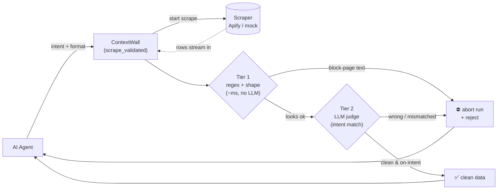
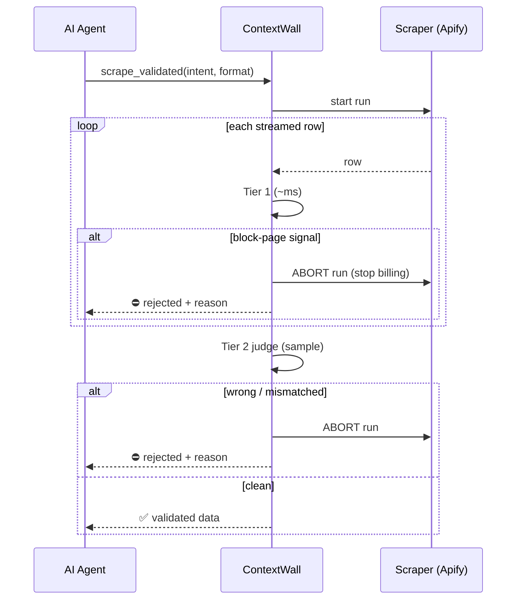

# ContextWall — Project Overview (start here)

> **TL;DR** — AI agents buy web-scraped data, but ~5% of scrapes silently fail
> (bot-blockers, CAPTCHAs, login walls) and come back as **fake "success"**: a
> valid-looking row whose content is really a block page. Agents ingest that
> garbage → wrong answers + wasted money. **ContextWall is a firewall that sits
> between the agent and the scraper, checks the data, and blocks the toxic stuff
> before it reaches the agent** — killing the cloud scrape job mid-run to stop
> the bill too.

If you only read one section, read **§3 (how it works)** and **§4 (what we built)**.

---

## 1. The problem (30 seconds)

When a scraper hits a site's bot-protection, it often gets a block page *instead
of* the data — dressed up to look like success. This is a **real row our scraper
got from `homedepot.com`** — note the **HTTP 200 "success"**:

```json
{ "url": "https://www.homedepot.com/", "statusCode": 200,
  "title": "", "text": "Powered and protected by Privacy" }
```

`200` means "all good" and the JSON shape is valid — so naive checks pass. But
the content isn't products; it's the site's anti-bot screen. **The status code
is the one thing a block page can fake, and it does** — there's no error to
notice. (More obvious blocks exist too: `yellowpages.com` returns a `403` with
the classic "Attention Required | Cloudflare" page. ContextWall catches both the
same way — by reading the *content*, never trusting the status code.)

Two harms:
1. **Context poisoning** — the agent reasons over block-page text → hallucinates / fails.
2. **Wasted money** — the agent pays LLM tokens to read junk, and paid for the failed scrape.

There's a subtler case too: data that's *real but wrong* — you asked for
"restaurants **with** delivery" and got dine-in-only places. Valid, useless.

## 2. What ContextWall is

A **data firewall + circuit breaker** that lives in the MCP tool layer (MCP =
the standard way agents call tools). The agent calls **our** tool,
`scrape_validated`, instead of the raw scraper. We validate the result *before*
it reaches the agent and return either clean data or a clear rejection.

Think of it as a **bouncer for an agent's context window.**

## 3. How it works — a two-tier funnel on a live stream

Rows are checked **as they stream in**, governed by one "abort" switch:



- **Tier 1 — Mechanical (pure code, milliseconds).** Runs on *every* row as it
  arrives: a regex blocklist (`Cloudflare`, `CAPTCHA`, `Access Denied`,
  `Powered and protected by Privacy`…) + a shape check. It reads the **content**,
  so it catches a block whether the site returned `200` or `403`. Trips on the
  **first poisoned row**.
- **Tier 2 — Semantic (LLM judge).** Fires once on the first few rows, *while
  more stream in*, using a cheap fast model (Gemini Flash-Lite) to check the
  data actually matches the agent's intent. Catches the "real but wrong" case.
  If the LLM is unavailable, it **degrades to a heuristic — it never just waves
  data through.**

The moment either tier says "trash," we **abort the cloud scrape job** — so it
stops running (and billing) before it finishes. Demo: a Cloudflare scrape stops
after ~1 of 12 rows, 0 toxic rows reach the agent, ~92% of the job never runs.



## 4. What we've actually built (full scope)

| Piece | What it is | Where |
|-------|-----------|-------|
| **MCP server** | Exposes one tool, `scrape_validated`, that agents call instead of a raw scraper | `src/index.ts` |
| **The firewall** | The stream-and-judge engine + abort logic (**the core**) | `src/firewall/index.ts` |
| ↳ Tier 1 | Regex blocklist + shape check, per row | `src/firewall/tier1.ts` |
| ↳ Tier 2 | Gemini semantic judge (+ offline heuristic fallback) | `src/firewall/tier2.ts` |
| **Scraper adapters** | Vendor-agnostic interface; live Apify + offline mock | `src/providers/` |
| **Apify real actor** | A deployed cloud actor that **actually scrapes any URL** — anti-bot sites hand it a real block page (`context-wall-real-actor`) | `Context-wall-real-actor` |
| **Apify mock actor** | Older deployed actor that streams fixed clean / block / mismatched fixtures on demand (`context-wall-mock-actor`) | `Context-wall-mock-actor` |
| **5 ways to see it run** | ↓ | ↓ |
| · Offline terminal demo | All 3 scenarios, no keys needed | `npm run demo` |
| · Live **real-scrape** demo | Scrapes a real URL; anti-bot sites trip the firewall | `npm run demo:url` |
| · Live fixture demo | Runs the older fixture actor in the cloud | `npm run demo:live hard` |
| · Buyer-agent simulator | A fake agent talks to us over real MCP and decides buy / don't-buy | `npm run agent` |
| · Web dashboard | Live animated funnel + tokens/$ saved | `npm run dashboard` → localhost:4000 |
| **Real agent integration** | Registered with Claude Code; an actual LLM agent can call it | see README |

**The pieces:**
- [`context-wall-poc`](https://github.com/shirley-xue-2025/context-wall-poc) — the firewall, MCP server, demos, dashboard (this repo).
- **`context-wall-real-actor`** — the Apify actor that **actually scrapes real URLs** (the live demo). Anti-bot sites hand it a genuine block page, so the demo is a real block, not a fixture. Deployed as `polite_bedbug/context-wall-real-actor`.
- [`Context-wall-mock-actor`](https://github.com/shirley-xue-2025/Context-wall-mock-actor) — the older fixture actor (fixed clean / block / mismatch rows), kept for deterministic offline-style demos.

## 5. See it yourself in 5 minutes

```bash
npm install
npm run demo            # offline, no keys — watch all 3 verdicts
npm run demo:url        # LIVE real scrape — a 200 "success" that's really a block (needs APIFY_TOKEN)
npm run dashboard       # → http://localhost:4000, click the scenarios
npm run agent           # watch a buyer agent decide buy / don't-buy
```

Full setup (keys, live mode, MCP registration) is in **[SETUP.md](SETUP.md)**.

## 6. Glossary (for the low-context reader)

- **MCP (Model Context Protocol)** — the standard interface agents use to call
  external tools. Our firewall *is* an MCP tool.
- **Apify actor** — a containerised scraper that runs in Apify's cloud and pushes
  results into a "dataset". Our mock actor is one of these.
- **Circuit breaker** — borrowed from electronics: when it detects a fault, it
  cuts the connection. Here, bad data trips it and we abort the scrape.
- **Context poisoning** — junk entering an LLM's context window, derailing its reasoning.
- **Tier 1 / Tier 2** — fast mechanical check first; slower smart LLM check only if needed.
- **Fail open vs. fail closed** — "open" = let data through on error (bad for a
  firewall); "closed/safe" = block or downgrade. We never fail open.

## 7. Pitching it to someone?

Non-technical explainers (30-second and 3-minute spoken versions) live in
**[PITCH.md](PITCH.md)**.
